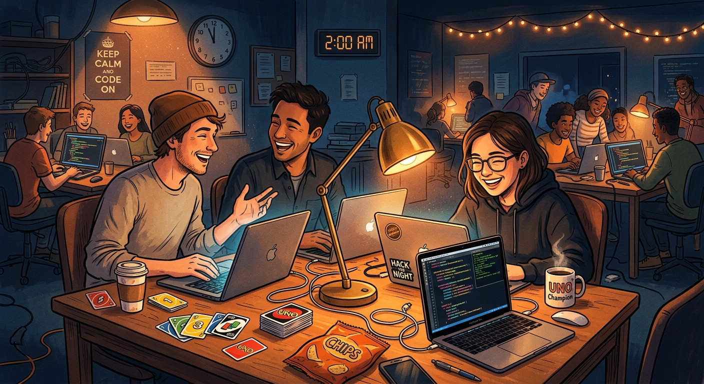
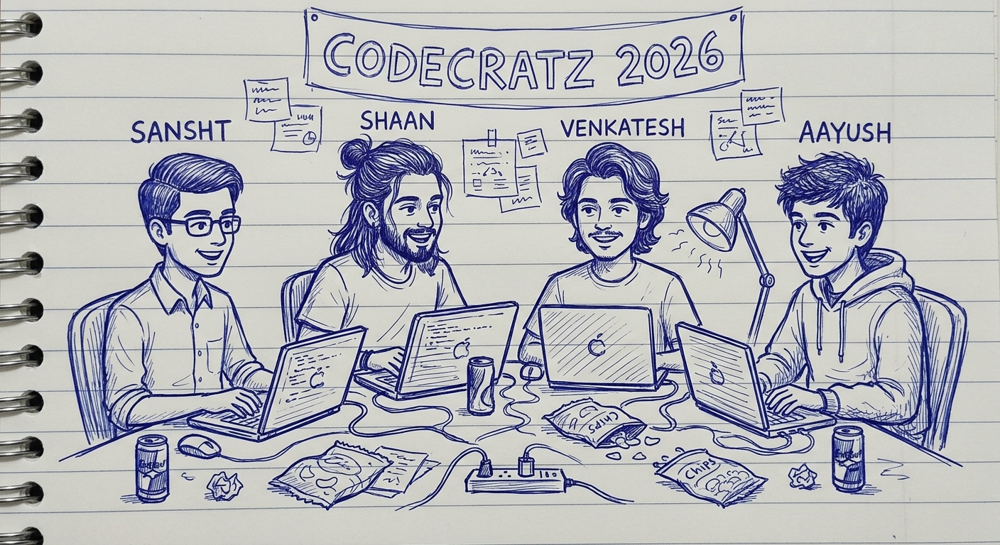

# 🤖 Discord Project Manager Bot

> Your AI-powered project management assistant that never sleeps. Automated reports, smart task tracking, and code reviews — all from Discord.



[](https://www.python.org/downloads/)
[](https://github.com/Rapptz/discord.py)
[](https://ollama.ai)
[](https://opensource.org/licenses/MIT)

---

## ✨ Features

### 📊 Automated Project Reports
Automated status updates twice daily — task completion, team performance, pending work, and GitHub activity delivered straight to your Discord channel.



### 🤖 AI-Powered Code Reviews
Every merged PR gets an automatic code review via local Ollama. Security scanning, vulnerability detection, and improvement suggestions — no external APIs needed.

### 💬 Conversational AI
Ask about your projects in plain English. The bot remembers context, pulls live data, and answers follow-up questions naturally.

---

## 🚀 Quick Start

### Prerequisites
- **Python 3.10+**
- **Discord Bot Token** — [Get one here](https://discord.com/developers/applications)
- **Ollama** (for AI features) — [Install here](https://ollama.ai)
- **GitHub Personal Access Token** — [Create here](https://github.com/settings/tokens)

### 1. Install Ollama

```bash
brew install ollama
ollama serve &
ollama pull llama3.1:8b
ollama pull qwen2.5-coder:14b
```

### 2. Setup

```bash
git clone https://github.com/AayushBhat07/discord-project-manager-bot.git
cd discord-project-manager-bot
python3 -m venv venv
source venv/bin/activate
pip install -r requirements.txt
cp .env.example .env
# Edit .env with your tokens
```

### 3. Configure

Edit `.env`:
```env
DISCORD_BOT_TOKEN=your_bot_token
REPORT_CHANNEL_ID=your_channel_id
WEBAPP_API_URL=https://your-app.convex.site
OLLAMA_BASE_URL=http://localhost:11434
GITHUB_TOKEN=ghp_your_token
```

### 4. Run

```bash
python bot.py
```

---

## 📋 Commands

### Project Management
| Command | Description |
|---------|-------------|
| `!status [project]` | Show project status |
| `!mytasks` | Show your assigned tasks |
| `!enable <project>` | Enable reports for a project |
| `!disable <project>` | Disable reports |

### AI Features
| Command | Description |
|---------|-------------|
| Just DM the bot naturally | Chat about projects |
| `!reset` | Clear conversation history |
| `!map-user <gh_user> @user` | Link GitHub to Discord |

---

## 🏗️ Project Structure

```
├── bot.py                    # Main bot
├── config.py                 # Configuration
├── services/
│   ├── api_service.py       # Web app API
│   ├── report_builder.py     # Report embeds
│   ├── github_pr_service.py  # GitHub integration
│   ├── conversational_ai_service.py  # Chat AI
│   └── code_review_builder.py      # Code reviews
├── .github/workflows/        # CI/CD
├── requirements.txt
└── README.md
```

---

## 🔒 Security

**Never commit `.env`** — it contains sensitive tokens. Already in `.gitignore`.

---

## 📄 License

MIT — use it, modify it, break it, fix it.

---

<p align="center">Built for builders who ship > sleep 🌙</p>
